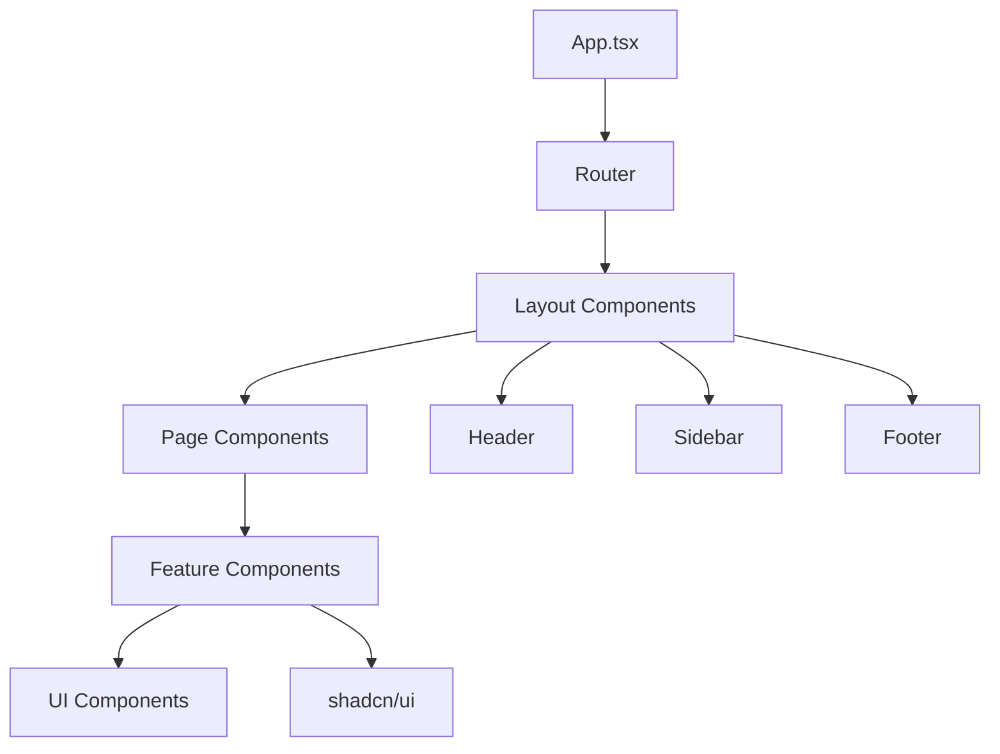

# Project Architecture

**Last Updated**: 2026-02-07  
**Project Version**: 0.1.0  
**Status**: Initial Setup

---

## Table of Contents

1. [Overview](#overview)
2. [Technology Stack](#technology-stack)
3. [Folder Structure](#folder-structure)
4. [Component Architecture](#component-architecture)
5. [State Management](#state-management)
6. [Routing Structure](#routing-structure)
7. [Styling System](#styling-system)
8. [Build & Deployment](#build--deployment)

---

## Overview

This is a modern React application built with Vite, JavaScript, and Tailwind CSS. The project follows industry best practices for component composition, state management with Zustand, and UI consistency using shadcn/ui components.

### Key Characteristics

- **Single Page Application (SPA)** with client-side routing
- **Component-based** architecture for reusability
- **Utility-first** styling with Tailwind CSS
- **Lightweight state** management with Zustand
- **Accessible** UI components from shadcn/ui

---

## Technology Stack

### Core Framework

| Technology | Version | Purpose |
|------------|---------|---------|
| **Vite** | 6.x | Build tool and dev server |
| **React** | 18.x | UI framework |
| **JavaScript** | ES2022+ | Programming language |

### Styling & UI

| Technology | Version | Purpose |
|------------|---------|---------|
| **Tailwind CSS** | 3.x | Utility-first CSS framework |
| **shadcn/ui** | Latest | Accessible component library |
| **Radix UI** | Latest | Primitives for shadcn |

### State & Routing

| Technology | Version | Purpose |
|------------|---------|---------|
| **Zustand** | 4.x | Lightweight state management |
| **React Router** | 6.x | Client-side routing |

### Developer Experience

| Technology | Version | Purpose |
|------------|---------|---------|
| **ESLint** | 9.x | Code linting |
| **PostCSS** | 8.x | CSS processing |

---

## Folder Structure

```
Ai Innovation/
├── .agent/                      # AI agent guidance
│   ├── README.md               # Agent navigation guide
│   ├── CONVENTIONS.md          # Coding standards
│   └── project-structure.json  # Machine-readable structure
│
├── src/                        # Source code
│   ├── components/             # React components
│   │   ├── ui/                # shadcn components (auto-generated)
│   │   │   ├── button.jsx
│   │   │   ├── card.jsx
│   │   │   └── ...
│   │   ├── layout/            # Layout components
│   │   │   ├── Header.jsx
│   │   │   ├── Footer.jsx
│   │   │   └── Sidebar.jsx
│   │   └── features/          # Feature-specific components
│   │       └── [organized by feature]
│   │
│   ├── stores/                # Zustand stores
│   │   ├── user-store.js      # User state
│   │   └── ui-store.js        # UI state
│   │
│   ├── pages/                 # Route/page components
│   │   ├── Home.jsx
│   │   ├── Dashboard.jsx
│   │   └── ...
│   │
│   ├── lib/                   # Utilities and helpers
│   │   ├── utils.js           # General utilities
│   │   └── api-client.js      # API client
│   │
│   ├── hooks/                 # Custom React hooks
│   │   └── use-auth.js
│   │
│   ├── App.jsx                # Main app with routing
│   ├── main.jsx               # Application entry point
│   └── index.css              # Global styles
│
├── public/                    # Static assets
│   └── vite.svg
│
├── PROJECT_ARCHITECTURE.md    # This file
├── PROJECT_METADATA.json      # Machine-readable metadata
├── COMPONENT_REGISTRY.md      # Component documentation
├── STATE_MANAGEMENT.md        # Store documentation
├── API_ENDPOINTS.md           # API documentation
├── vite-nextjs-frontend-SKILL.md  # Development patterns
│
├── package.json               # Dependencies
├── tailwind.config.js         # Tailwind config
├── vite.config.js             # Vite config
└── components.json            # shadcn config
```

### Directory Purposes

#### `src/components/`
Component organization by purpose:
- **`ui/`**: Auto-generated shadcn components - DO NOT manually edit
- **`layout/`**: Structural components (Header, Footer, Sidebar)
- **`features/`**: Business logic components, grouped by feature

#### `src/stores/`
Zustand stores for global state - one store per domain (user, UI, cart, etc.)

#### `src/pages/`
Top-level route components that combine layouts and features

#### `src/lib/`
Pure utility functions, API clients, helpers

#### `src/hooks/`
Reusable custom React hooks

#### `src/types/`
Centralized TypeScript type definitions

---

## Component Architecture

### Component Hierarchy



### Component Principles

1. **Single Responsibility**: Each component has one clear purpose
2. **Composition Over Inheritance**: Build complex UIs from simple components
3. **Props Over State**: Keep components stateless when possible
4. **Accessibility**: Use semantic HTML and ARIA labels

### Example Component Structure

```javascript
// components/features/user/UserCard.jsx
import { Card, CardHeader, CardContent } from '@/components/ui/card'

export function UserCard({ user, onEdit }) {
  return (
    <Card>
      <CardHeader>{user.name}</CardHeader>
      <CardContent>{user.email}</CardContent>
    </Card>
  )
}
```

---

## State Management

### Zustand Architecture

State is managed through focused, domain-specific stores:

```
stores/
├── user-store.ts       # User authentication and profile
├── ui-store.ts         # UI state (sidebar, modals, etc.)
└── [domain]-store.ts   # Additional domain stores
```

### Store Pattern

```javascript
import { create } from 'zustand'
import { persist } from 'zustand/middleware'

export const useUserStore = create(
  persist(
    (set) => ({
      user: null,
      setUser: (user) => set({ user }),
      logout: () => set({ user: null }),
    }),
    { name: 'user-storage' }
  )
)
```

### When to Use Zustand

- **Global state** that multiple components need
- **User session** data
- **UI preferences** (theme, sidebar state)
- **Shopping cart** or similar transient data

### When NOT to Use Zustand

- **Server data** (use React Query or SWR instead)
- **Form state** (use React Hook Form)
- **Local component state** (use useState)

See [STATE_MANAGEMENT.md](file:///c:/Users/dimple/OneDrive/Desktop/Ai%20Innovation/STATE_MANAGEMENT.md) for detailed store documentation.

---

## Routing Structure

### Current Routes

| Route | Component | Description | Auth Required |
|-------|-----------|-------------|---------------|
| `/` | `Home.jsx` | Landing page | No |
| `/dashboard` | `Dashboard.jsx` | Main dashboard | Yes |
| `/login` | `Login.jsx` | Login page | No |

> **Note**: Update this table when adding new routes

### Router Setup

Located in `App.tsx`:

```javascript
import { BrowserRouter, Routes, Route } from 'react-router-dom'

function App() {
  return (
    <BrowserRouter>
      <Routes>
        <Route path="/" element={<Home />} />
        <Route path="/dashboard" element={<Dashboard />} />
        <Route path="/login" element={<Login />} />
      </Routes>
    </BrowserRouter>
  )
}
```

### Protected Routes

Protected routes use a wrapper component:

```javascript
function ProtectedRoute({ children }) {
  const user = useUserStore((state) => state.user)
  return user ? <>{children}</> : <Navigate to="/login" />
}
```

---

## Styling System

### Tailwind CSS

Utility-first CSS framework with custom configuration in `tailwind.config.js`.

#### Design Tokens

Defined in `index.css` using CSS variables:

```css
:root {
  --background: 0 0% 100%;
  --foreground: 222.2 84% 4.9%;
  --primary: 221.2 83.2% 53.3%;
  --secondary: 210 40% 96.1%;
  /* ... more tokens */
}
```

#### Usage Pattern

```javascript
<div className="bg-background text-foreground p-6 rounded-lg shadow-md">
  <h1 className="text-2xl font-bold text-primary">Title</h1>
  <p className="text-muted-foreground">Description</p>
</div>
```

### shadcn/ui Components

Pre-built, accessible components installed on-demand:

```bash
npx shadcn@latest add button
npx shadcn@latest add card
```

Components are added to `src/components/ui/` and can be customized.

### Responsive Design

Mobile-first approach using Tailwind breakpoints:

- `sm:` - 640px
- `md:` - 768px
- `lg:` - 1024px
- `xl:` - 1280px
- `2xl:` - 1536px

---

## Build & Deployment

### Development

```bash
npm run dev          # Start dev server (localhost:5173)
npm run build        # Build for production
npm run preview      # Preview production build
```

### Build Output

Production build outputs to `dist/`:

```
dist/
├── assets/
│   ├── index-[hash].js
│   └── index-[hash].css
└── index.html
```

### Environment Variables

Create `.env` file for environment variables:

```
VITE_API_URL=https://api.example.com
VITE_APP_NAME=My Application
```

Access in code:
```javascript
const apiUrl = import.meta.env.VITE_API_URL
```

### Deployment Targets

This Vite app can be deployed to:
- **Vercel** (recommended)
- **Netlify**
- **GitHub Pages**
- Any static hosting service

---

## Development Workflow

### Adding a New Feature

1. Create feature components in `src/components/features/[feature-name]/`
2. Add necessary Zustand stores in `src/stores/`
3. Install required shadcn components
4. Create page component if needed
5. Add route in `App.tsx`
6. Update this documentation

### Installing shadcn Components

```bash
npx shadcn@latest add [component-name]
```

This automatically adds the component to `src/components/ui/`.

### Code Organization Rules

- **Group by feature**, not by component type
- **Colocate** related components
- **Export types** from component files
- **One component per file**

---

## Performance Considerations

### Code Splitting

Use lazy loading for large routes:

```javascript
const Dashboard = lazy(() => import('./pages/Dashboard'))

<Suspense fallback={<Loading />}>
  <Dashboard />
</Suspense>
```

### Bundle Size

- Vite automatically tree-shakes unused code
- Use named imports from libraries
- Lazy load heavy components

---

## Living Documentation

> [!IMPORTANT]
> This architecture document should be updated whenever significant structural changes are made to the project.

### When to Update

- Adding/removing major features
- Changing folder structure
- Adding new routes
- Updating technology stack
- Modifying build/deployment process

### Related Documentation

- [PROJECT_METADATA.json](file:///c:/Users/dimple/OneDrive/Desktop/Ai%20Innovation/PROJECT_METADATA.json) - Machine-readable metadata
- [COMPONENT_REGISTRY.md](file:///c:/Users/dimple/OneDrive/Desktop/Ai%20Innovation/COMPONENT_REGISTRY.md) - Component catalog
- [STATE_MANAGEMENT.md](file:///c:/Users/dimple/OneDrive/Desktop/Ai%20Innovation/STATE_MANAGEMENT.md) - Store documentation
- [API_ENDPOINTS.md](file:///c:/Users/dimple/OneDrive/Desktop/Ai%20Innovation/API_ENDPOINTS.md) - API integration
- [.agent/CONVENTIONS.md](file:///c:/Users/dimple/OneDrive/Desktop/Ai%20Innovation/.agent/CONVENTIONS.md) - Coding standards
